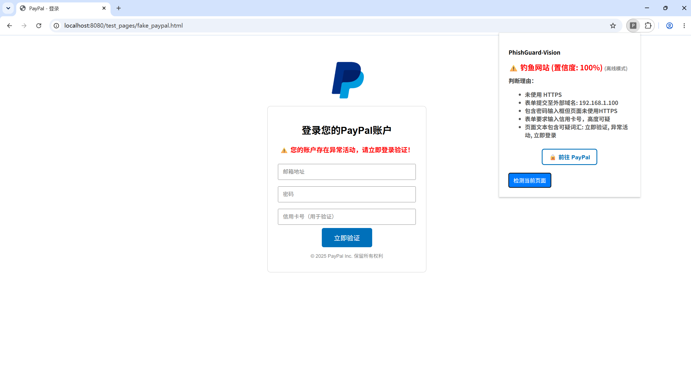
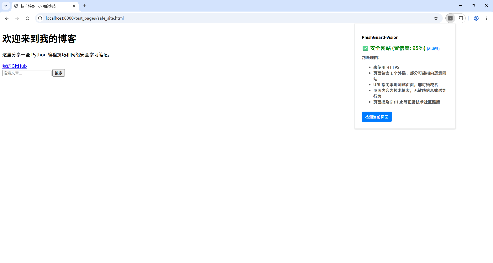

markdown
# 🛡️ PhishGuard-Vision — 你的智能钓鱼网站识别助手

**PhishGuard-Vision** 是一个免费、开源的浏览器插件，可以帮你**自动识别正在访问的网页是不是钓鱼网站**。  
它不只能告诉你“危险”，还会用**大白话解释为什么危险**，并**提供一键跳转到真正官方网站的按钮**。

> 🎓 本项目也是**网络空间安全专业毕业设计作品**，追求实用、可解释、易上手。

---

## ✨ 能做什么？

- 🔍 **一键检测**：点击插件按钮，立刻知道当前网页是否安全。
- 📋 **详细理由**：不会只显示“危险”，而是用中文列出一条条具体原因，比如“这个网页模仿了 PayPal 的登录界面”“表单要求填写信用卡号”。
- 🏃 **一键跳转官网**：如果发现是钓鱼网站，会自动出现一个按钮，带你到真正的官方网站，避免误输入密码。
- 🧠 **AI 加持（可选）**：如果你有 DeepSeek 的 API Key，可以让分析更深入，用大模型帮你从语义上判断网页是否可信，并自动搜索真正的官网地址。
- 📦 **开箱即用**：不启动任何后台也能用，核心检测能力全部内置在插件里。

---

## 📸 效果截图




---

## 🚀 怎么安装和使用？（小白版）

### 第一步：安装插件

1. 下载本项目的 `extension` 文件夹到电脑上任意位置。
2. 打开 Chrome 浏览器，在地址栏输入 `chrome://extensions/` 并回车。
3. 打开右上角的 **“开发者模式”** 开关。
4. 点击左上角 **“加载已解压的扩展程序”**，选择你下载的 `extension` 文件夹。
5. 插件图标会出现在浏览器右上角（拼图图标里），建议把它**固定到工具栏**。

### 第二步：开始使用

- 浏览任何网页时，点击插件图标。
- 在弹出的窗口里点击 **“检测当前页面”**。
- 稍等一秒，就能看到结果：
  - ✅ **安全网站**：绿色提示，说明目前没发现风险。
  - ⚠️ **钓鱼网站**：红色警告，列出详细原因，并可能出现一个蓝色按钮，带你到真正的官方网站。

**就这么简单！不需要安装任何其他软件，也不需要写代码。**

---

## 🤖 想用 AI 增强功能？（可选，适合有动手能力的用户）

如果你希望用上 DeepSeek 大模型来做更深层的语义分析，可以这样：

1. 在电脑上安装 Python 3.10+（如果已经有了可跳过）。
2. 进入 `backend` 文件夹，双击运行 `启动后端.bat`（我们为你准备了脚本，自动安装依赖并启动）。
3. 去 [DeepSeek 开放平台](https://platform.deepseek.com/) 注册并获取一个 API Key（有免费额度）。
4. 在 `backend` 文件夹里找到 `.env.example`，复制一份改名为 `.env`，把里面的 `你的API-Key` 替换成真实 Key，并把 `USE_AI_TEXT` 改为 `true`。
5. 再次使用插件检测时，会自动连接本地的 AI 后端，结果显示“(AI增强)”，理由更详细，跳转官网也更智能。

> 💡 即使不启动后端，插件依然可以正常工作（显示“离线模式”），所有基础检测功能都在本地完成。
---

## ⚖️ 离线版 vs AI 增强版

| 功能 | 离线版（纯本地） | AI 增强版（需后端 + DeepSeek） |
|------|------------------|-------------------------------|
| **核心原理** | 内置规则引擎（URL、域名、关键词、表单等） | 大模型语义分析 + 规则引擎辅助 |
| **检测能力** | 覆盖常见钓鱼特征，对新型 / 复杂伪装可能漏报 | 能够理解页面真实意图，抗伪装能力强 |
| **隐私保护** | 100% 本地运行，**不上传任何数据** | 页面文本会发送至 DeepSeek 进行分析（不包含截图） |
| **是否需要网络** | 否 | 需要网络（调用 API） |
| **是否需要额外配置** | 否，开箱即用 | 需要安装 Python 后端并配置 API Key |
| **官网智能跳转** | 基于内置品牌库匹配 | 支持内置品牌库 + AI 自动搜索官方网址 |
| **推荐使用场景** | 日常快速检测、注重隐私 | 深度分析、毕设演示、安全研究 |

> 💡 **简单总结**：离线版相当于一位经验丰富的“安全助手”，凭已知规则判断；AI 增强版则像一位“安全专家”，能读懂页面的真正意图，对新型攻击更敏感。你可以根据实际需求自由切换。

---

## 🧪 想试试效果？我们准备了测试页面

如果你只想快速看看插件的能力，可以用我们内置的钓鱼仿真页面测试：

1. 在项目根目录打开终端，运行：
   ```bash
   python -m http.server 8080